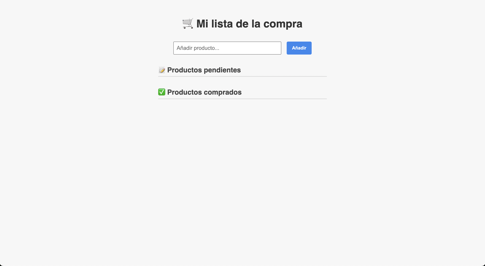

# 🛒 ListMyShop

**ListMyShop** is a simple and responsive shopping list web application built with HTML, CSS and JavaScript.

Add, check off, and move items between "pending" and "purchased" lists with a clean and mobile-friendly interface. Designed to be fast, lightweight, and usable from any device — including your smartphone.

---

## 📸 Preview

 <!-- Optional: replace with your own screenshot -->

---

## ✨ Features

- ✅ Add products to your shopping list
- 🔁 Tap to mark as "purchased" or move back to pending
- 🧮 Auto-numbered items with circular badges
- 📱 Fully responsive design (mobile-ready)
- 🎨 Clean UI with hover and transition effects
- 🐳 Docker-ready for easy local access from your network

---

## 🚀 How to Run Locally

### 🔧 Option 1: Open in Browser

Just open `index.html` in your browser.

---

### 🐳 Option 2: Run with Docker

```bash
# Build the Docker image
docker build -t listmyshop .

# Run the container
docker run -d -p 8080:80 --name listmyshop listmyshop
